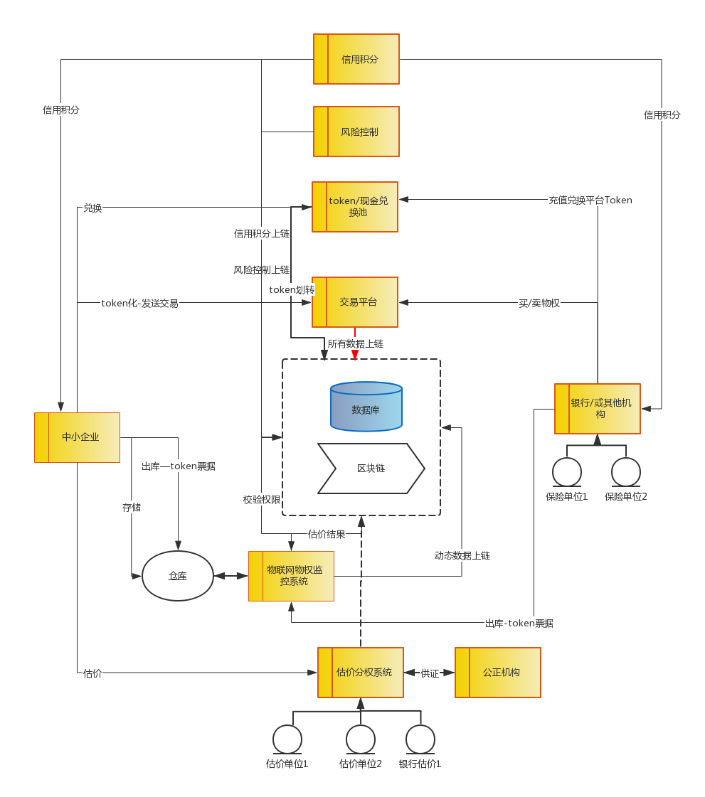
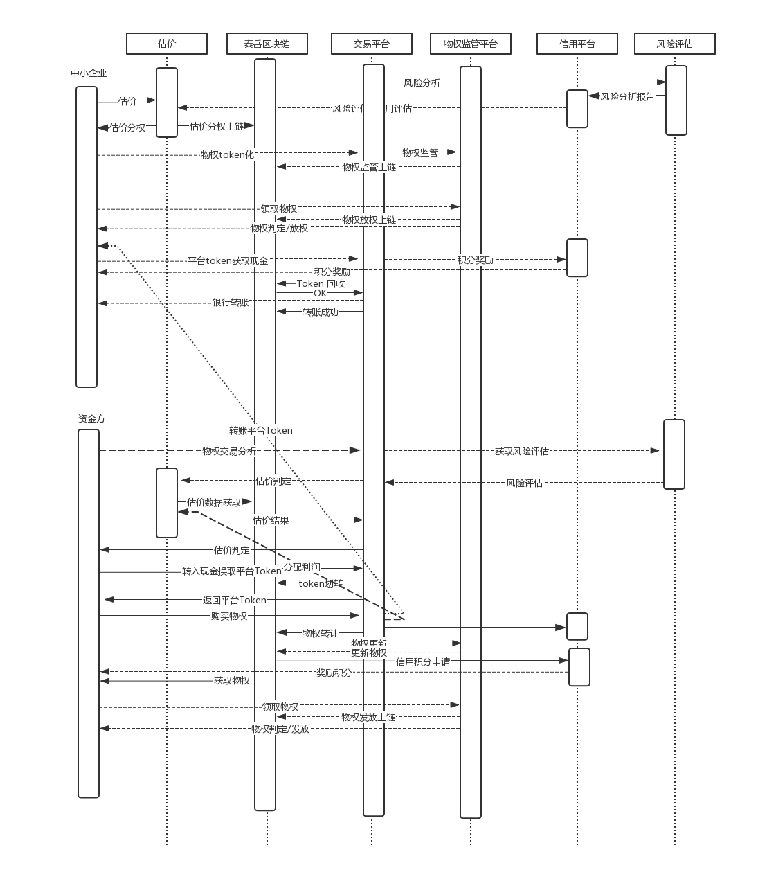

.. _topInstroduction:

泰岳区块链整体介绍
======================

泰岳区块链是国产自主可控的面向政府、企业及产业联盟的开源区块链底层基础设施，具有高性能，高可用，高适配，强隐私保护，高模块化等特性，支持大批量的业务数据上链，支持PB级数据处理，泰岳区块链通过核心框架的开源和相关开发能力的输出，能够满足政府及多元化企业用户的多元化需求。泰岳区块链团队是全国区块链和分布式记账技术标准化技术委员会工作组成员，拥有多项区块链核心专利。

泰岳区块链特点
---------------------

1、模块化设计

    泰岳区块链采用模块化设计，利用配置TOML文件来配置模块

    * 加密算法，  支持SM2/SM3/SM4 和 S256/AES/sha3两组，可以通过TOML文件中的"kindOfCrypto"字段进行配置。

    * 权限可配置， 对于有些企业并不希望支持权限，根据不同的企业需求，企业可以自己选

    * 证书可选择，目前证书支持Certificate的类型有 国密类型，和RSA 两种。

2、高性能

    泰岳联盟链性能测试高达20000TPS

3、符合监管

    | 泰岳区块链监管开发中。

4、支持DCEP

    泰岳区块链，采用跨链协议，采用中间人机制，实现来首个支持DCEP的联盟链主链。

泰岳区块链应用介绍
------------------------

金融
>>>>>>>>>>>>>>

背景
::::::::::::::::::::

    2019年10月24日下午，中共中央政治局就区块链技术发展现状和趋势进行第十八次集体学习。习近平总书记在学习讲话中指出：“区块链技术的集成应用在新的技术革新和产业变革中起着重要作用。我们要把区块链作为核心技术自主创新的重要突破口，明确主攻方向，加大投入力度，着力攻克一批关键核心技术，加快推动区块链技术和产业创新发展。

    习近平总书记指出，要抓住区块链技术融合、功能拓展、产业细分的契机，发挥区块链在促进数据共享、优化业务流程、降低运营成本、提升协同效率、建设可信体系等方面的作用。要推动区块链和实体经济深度融合，解决中小企业贷款融资难、银行风控难、部门监管难等问题。
    供

    应链金融是供应链管理的一个分支，供应链管理是指对整个供应链系统进行计划、协调、操作、控制和优化的各种活动和过程。同时供应链金融是一个在产业链基础上，通过交易，资金调配，风险管理等手段，运用自偿性贸易融资的方式。

传统行业痛点
::::::::::::::::::::

    针对于庞大的供应链金融平台，涉及各个企业和环节，任何落后的环节都有可能导致整个生态的不稳定。以下就是一些详细的痛点。

    * 融资难、融资贵、债权债务处理难

    * 征信方式陈旧，征信效率低下、信用体系没有形成，数据信息作假

    * 资金流动不畅通，企业间资源共享和业务协同难

    * 几大孤岛：信息孤岛，数据孤岛，流程孤岛，信用孤岛，资源孤岛，风控孤岛，产业孤岛，服务孤岛

区块链赋能
::::::::::::::::::::

    区块链技术的防篡改、可溯源，分布式存储给供应链金融中的去伪存真、鉴权、防扯皮、信息协同等方面带来极大的改善，供应链金融将走向数字化形式，可以依托区块链技术的范式，构造成未来的产业形态。

    同时区块链技术可以给结合物流管理，仓库管理进行物品的确权和估价，配合风控平台进行风险控制。分布式存储给供应链金融的数据共享带来新的模式，信息孤岛不复存在。准入链的方式，让各个参与方都能够同时共享相同的数据。

解决方案
::::::::::::::::::::

    供应链金融架构

    供应链金融流程图-仓单

医疗数据
>>>>>>>>>>>>>>>>>>

