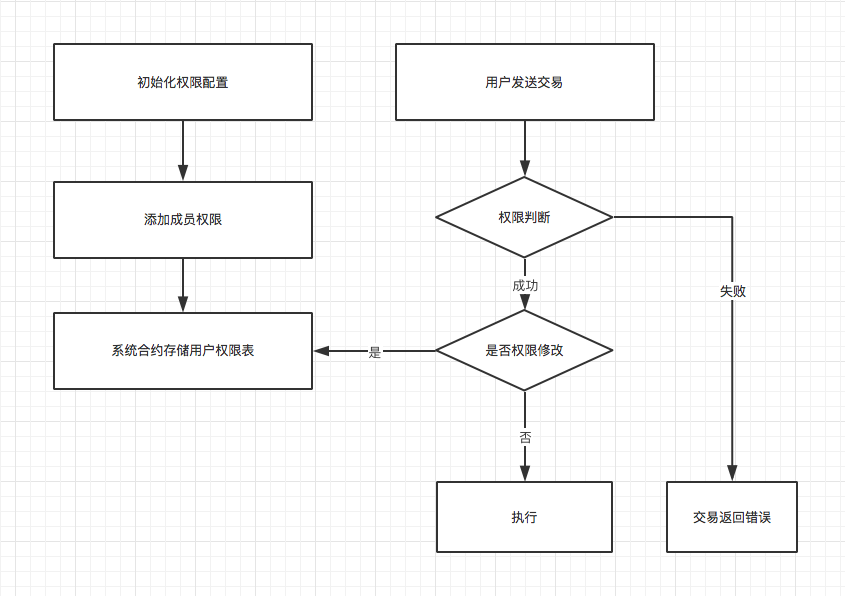

.. _Authority:

权限控制
======================

    权限设计是泰岳区块链为了满足企业内部对数据库的访问权限要求而设计。

权限控制介绍
------------------------
    准入链是联盟链的另外一个称呼，为了实现准入，保证企业用户数据的安全，可以通过CA网络访问准入，到分部署署数据存储的安全访问。

    为了体现 **权限** 和 **控制** 的概念，泰岳区块链设计可控制的权限管理模式，包括从访问程度和访问控制（白名单和黑名单 有效的控制），为联盟链治理和数据管理提供有效手段。
    泰岳联盟链权限管理着重管理发送转账交易权限， 创建合约权限，创建组权限，合约访问权限，监管黑名单，监管白名单等6权限进行管理和控制。

权限控制规则
------------------------
    权限控制规则如下：

    1、每个大类的权限管理都包含管理员和普通成员

    2、其中 转账交易权限和创建合约权限是基础权限，任何基础权限都和联盟成员绑定，系统会最开始的时候绑定联盟成员形成表格。

    3、黑名单和白名单属于最高权限的判断。

    4、组是一个架构单位，本身不具备功能，只有把组加入的相应的权限里面，他一下的成员都具备了权限。

    5、组可以嵌套组

    6、合约访问权限需要在创建合约后进行合约创建

    7、7大类的权限都有黑名单有效和白名单有效。其中基础权限有系统启动的时候配置，合约权限由合约创建组配置。

权限控制细则
------------------------
    **权限控制详细如下：**

    * ModifyPerminType_AddSendTxPerm
        功能：添加用户发送转账交易权限

        描述：这个权限是用来给 用户（拥有私钥）授予发送交易的权限，这个权限属于基础权限，需要N个委员会（联盟成员）来进行授予。

    * ModifyPerminType_DelSendTxPerm
        功能：删除用户发送转账交易权限

        描述：如果用户拥有发送转账交易的权限，发送转账交易权限的管理员，或者联盟成员拥有权限删除发送交易的权限。

    * ModifyPerminType_AddSendTxManagerPerm
        功能：添加用户发送转账交易管理权限

        描述：该权限拥有发送交易转账交易权限，并且拥有ModifyPerminType_AddSendTxPerm，ModifyPerminType_DelSendTxPerm，ModifyPerminType_DelSendTxManagerPerm的权限。

    * ModifyPerminType_DelSendTxManagerPerm
        功能：删除发送转账交易管理员权限

        描述：该权限用户将失去发送交易的权限。

    * ModifyPerminType_AddCrtContractPerm
        功能：添加用户创建合约权限

        描述：该权限是给用户授予创建合约的权限，用户可以通过交易创建合约。

    * ModifyPerminType_DelCrtContractPerm
        功能：删除用户创建合约权限

        描述：该权限是删除用户创建合约的权限，用户通过交易创建合约。

    * ModifyPerminType_AddCrtContractManagerPerm
        功能：添加用户创建合约管理员权限

        描述：该权限授予用户拥有ModifyPerminType_AddCrtContractPerm，ModifyPerminType_DelCrtContractPerm，ModifyPerminType_DelCrtContractManagerPerm等权限。

    * ModifyPerminType_DelCrtContractManagerPerm
        功能：删除用户创建合约管理员权限

        描述：该权限删除用户创建合约管理员权限，用户不再拥有管理员权限，但是不影响其他。

    * ModifyPerminType_AddGropManagerPerm
        功能：添加组管理员权限,组不具备任何权限，组是一个组织架构，组可以成为其他组的成员。如果需要把其他人添加进入其他权限，可以直接添加进入组，后把组添加进入权限。

        描述：该权限是可以添加，删除。其他成员或者组进入成员或者管理员，拥有ModifyPerminType_AddGropManagerPerm，ModifyPerminType_DelGropManagerPerm，ModifyPerminType_AddGropMemberPerm，ModifyPerminType_DelGropMemberPerm等权限。

    * ModifyPerminType_DelGropManagerPerm
        功能：删除组管理员权限，将某个管理员删除权限。

        描述：需要组创建者，组管理员，删除某个成员的管理员权限。

    * ModifyPerminType_AddGropMemberPerm
        功能：添加组成员，组成员和组所在的权限相同。

        描述：通过组管理员或者组创建者可以删除组成员。。

    * ModifyPerminType_DelGropMemberPerm
        功能：删除组成员。组所在的权限，被删除成员不在拥有的组所在的权限

        描述：删除组成员。

    * ModifyPerminType_CrtContractPerm
        功能：创建合约权限

        描述：**任何合约的创建都需要合约创建者调用这个权限设置**，对合约进行权限的设定，设定需要制定是白名单有效还是黑名单有效。

    * ModifyPerminType_AddContractManagerPerm
        功能：添加合约访问管理员

        描述：合约管理员拥有对合约权限的管理和访问权限，拥有ModifyPerminType_AddContractMemberPerm，ModifyPerminType_DelContractMemberPerm，ModifyPerminType_DelContractManagerPerm，ModifyPerminType_AddContractManagerPerm权限。

    * ModifyPerminType_DelContractManagerPerm
        功能：删除合约访问管理员

        描述：被删除的管理员权限不再拥有该合约的管理员的权限。

    * ModifyPerminType_AddContractMemberPerm
        功能：添加用户成为合约的成员，成员拥有合约的方法访问权限。

        描述：合约成员，拥有对合约的访问权限。

    * ModifyPerminType_DelContractMemberPerm
        功能：删除合约的访问成员

        描述：用户无法访问该合约。

    * ModifyPerminType_AddWhitListPerm
        功能：添加进入白名单权限

        描述：该权限为监管权限，只有监管账户可以添加，该权限拥有最高权限。

    * ModifyPerminType_DelWhitListPerm
        功能：删除白名单成员权限

        描述：该权限只有白名单里面的成员拥有该权限，被删除后，失去最高权限。

    * ModifyPerminType_AddBlockListPerm
        功能：添加进入黑名单权限

        描述：该权限只有白名单里面的成员，拥有该权限，被添加进黑名单的成员没有任何权限。

    * ModifyPerminType_DelBlockListPerm
        功能：删除黑名单成员权限

        描述：该权限将黑名单成员删除。

    * PerminType_SendTx
        功能：发送交易权限判断

        描述：会判断用户是否拥有白名单权限，和所在组是否在 **发送转账交易** 的管理员和成员里面。

    * PerminType_CreateContract
        功能：创建合约权限判断

        描述：会判断用户是否拥有白名单权限，和所在组是否在 **创建合约** 的管理员和成员里面。

    * ModifyPerminType_DelGrop
        功能：删除组权限

        描述：该权限是指用户是否拥有删除组的权限。

    * ModifyPerminType_CrtGrop
        功能：创建组权限

        描述：如果用户具有PerminType_SendTx权限， 默认就拥有该权限。

    * ModifyPerminType_AddSendTxPerm
        功能：添加发送转账交易权限

        描述：s。

    * PerminType_AccessContract
        功能：访问合约权限

        描述：如果用户所在组、合约的管理员或者成员，合约创建者，那么就拥有该权限。

权限控制配置
------------------------
**权限配置拥有两个：**

    * 配置发送转账交易权限

        配置Genesis.json

            permisionWlSendTx: 表示链是否允许所有地址默认拥有发送交易权限，0--白名单无效，1--白名单有效。

    * 配置创建合约转账权限
        配置Genesis.json

            permisionWlCreateTx: 表示链是否允许所有地址默认拥有创建合约交易权限，0--白名单无效，1--白名单有效。

权限控制流程设计
------------------------

    权限控制流程

